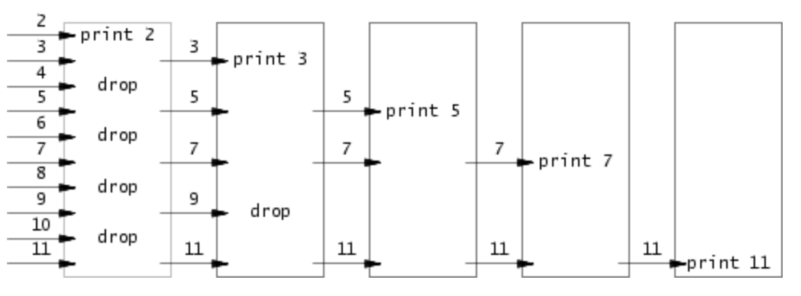
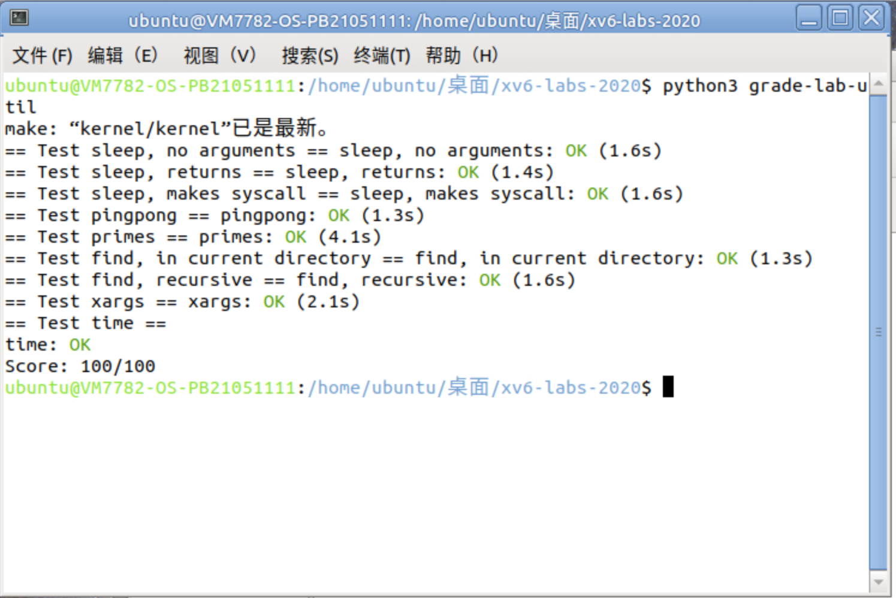

# Lab1 Utils

- 姓名：吴欣怡
- 学号：PB21051111
- 虚拟机用户名：OS-PB21051111

## sleep

### 实验分析
输入形如 sleep 100的参数，需要实现使当前进程暂停相应的时钟周期数的sleep程序。需要用到sleep函数暂停、atoi函数转化字符串型和整形变量。

### 实验过程

参考其他程序，引入头文件 kernel/types.h 和user/user.h。主函数接收两个参数，如果参数为2个，即报错并退出。
如果参数为2个，则调用sleep函数。在此之前，需要把输入的字符串参数转化为整形变量time。结束后正常退出。
```
#include "kernel/types.h"
#include "user/user.h"

int main(int argc, char *argv[])
{
    // 如果命令行参数不等于2个，则打印错误信息，并退出
    if (argc != 2)
    {
        write(2, "parameter error", strlen("parameter error\n"));
        exit(1);
    }
    // 把字符串型参数转换为整型
    int time = atoi(argv[1]);
    if (time <= 0) exit(1);
    // 调用 sleep 函数，传入整型参数
    sleep(time);
    // 正常退出程序
    exit(0);
}
```


## pingpong

### 实验分析
 pingpong需要在一对管道上实现父子进程之间的通信。父进程通过第一个管道给子进程发送一个信息 “ping”，子进程接收父进程的信息后打印 "<ID>: received ping" 。然后子进程通过另一个管道发送一个信息 “pong” 给父进程，父进程接收子进程的信息然后打印 "<ID>: received pong" ，然后退出。
所以我们需要创建两个管道，根据fork()的值，分别编写父子进程程序，利用read\write从管道的两个参数中读取和写入“ping”“pong”


### 实验过程
头文件 kernel/types.h 和 user/user.h 。
main 函数中定义两个文件描述符 pipefd1 和 pipefd1 数组，用于创建两个管道， 分别用于父到子、子到父的信息传递。系统调用会创建管道，并把读取和写入的文件描述符返回到 pipefd 中。 pipefd[0] 指管道的读取端， pipefd[1] 指管道的写入端。
缓冲区字符数组buffer[4]，存放传递的信息。
fork 创建子进程，子进程的 fork 返回值为 0 ，父进程的 fork 返回子进程的进程 ID ，通过 if 语句让父进程和子进程执行不同的代码块。
系统调用write()需要三个参数，分别为管道写入端文件描述符，写入的字符串，字符串长度。read()同理，对应管道读取端文件描述符。
编写父进程执行的代码块：write()把字符串 "ping" 写入管道一。调用 wait() 函数等待子进程完成操作后退出。read()接收从管道二（子到父）传来的信息，读取到缓冲区字符数组。最后调用 printf() 函数打印当前进程 ID 以及接收到的信息，即缓冲区的内容。
编写子进程执行的代码块： read() read()接收从管道一（父到子）传来的信息，读取到缓冲区字符数组然后调用 printf() 函数打印当前进程 ID 以及接收到的信息，即缓冲区的内容。 write() 把字符串 "ping" 写入管道二。
最后调用 exit() ，程序正常退出。
```
#include "kernel/types.h"
#include "kernel/stat.h"
#include "user/user.h"
 
int main(int argc, char *argv[])
{
    int pipefd1[2],pipefd2[2];
    char buffer[4];
    pipe(pipefd1);//创建管道
    pipe(pipefd2);
    if(fork() == 0)
    {
        read(pipefd1[0],buffer,sizeof(buffer));
        printf("%d: received %s\n",getpid(),buffer);
        write(pipefd2[1],"pong",strlen("pong"));
    }
        
    else
    {
        write(pipefd1[1],"ping",strlen("ping"));
        wait(0);
        read(pipefd2[0],buffer,sizeof(buffer));
        printf("%d: received %s\n",getpid(),buffer);
    }
    exit(0);
    
}
```
## primes

### 实验分析

使用管道，将2-35中的素数打印出来。采用从最小的数开始筛选，筛选出一个素数k，并且从k-35中舍弃所有能被k整除的数字，再传入右边的邻居进行进一步筛选的思路。

### 实验过程
采用数组，存储2-35这34个数。写一个递归函数select，其功能是实现读入当前数组和数组长度两个参数后，用一个子进程读取所有数组中的内容，写入管道，用另一个子进程读取管道内容，筛选掉所有能被数组首元素整除的数，把剩下的数存入数组，进入下一次迭代，直至数组数为1，输出最后一个素数并且迭代终止。每次迭代中，输出当前数组的第一个数（因为不存在比它更小的数字可以整除它，它一定是一个素数）。

```
#include "kernel/types.h"
#include "user/user.h"

void select(int *input, int num){
	if(num == 1){
		printf("prime %d\n", *input);
		return;
	}
	int p[2],i;
	int prime = *input;//prime是第一个数，是被除数
	int temp;
	printf("prime %d\n", prime);
	pipe(p);
    if(fork() == 0){
        for(i = 0; i < num; i++){
            temp = *(input + i);
			write(p[1], (char *)(&temp), 4);
		}
        exit(0);
    }
	close(p[1]);
	if(fork() == 0){
		int counter = 0;
		char buffer[4];
		while(read(p[0], buffer, sizeof(int)) != 0){//读取所有左邻传入的数
			temp = *((int *)buffer);//转成整数形式
			if(temp % prime != 0){
				*input = temp;
				input += 1;
				counter++;
			}
		}
		select(input - counter, counter);
		exit(0);
    }
	wait(0);
	wait(0);
}

int main(){
    int input[34];
	for(i=0; i < 34; i++){
		input[i] = i+2;
	}//定义保存了2-35的数组
	select(input, 34);
    exit(0);
}

```
## find

### 实验分析
实现find，在指定的目录及其子目录中查找包含特定名称的文件，并打印它们的路径。
main函数要接收三个参数，包括目录路径和目标文件名。
构建缓冲区，来保存目标目录路径 directory 与每个目录条目的名称组合起来的目录的绝对路径
参考ls函数，有以下几种情况应该输出错误信息并结束程序：打开文件失败、目标不是目录类型、路径长度大于缓冲区。
递归地遍历目录结构，需要避开“.”和“..”，分为新的buf状态为目录类型或文件类型两种情况，前者继续调用find函数，后者查找和目标文件名对应的，输出文件路径。

### 实验过程
 打开目标目录directory并获取其文件描述符fd。
 使用 fstat 函数获取目标目录的文件状态信息
 如果fstat获得的文件类型不是目录类型，则输出错误信息，并关闭文件描述符，返回。
 如果路径过长无法放入缓冲区，则输出错误信息，关闭文件描述符，返回。
 将目录路径复制到缓冲区 buf 中，并设置指针 p 指向文件名的位置。
 通过循环，读取目录中的每个目录条目de。
 如果目录条目的 inum 为零，表示无效，跳过。
 如果目录条目的名称为 "." 或 ".."，表示当前目录或上级目录，跳过。
 将目录条目的名称复制到缓冲区中的适当位置，并在末尾添加文件名结束符。
 使用 stat 函数获取缓冲区（目标路径）的文件状态信息，并将其存储在结构体中。
 如果文件类型是目录，则递归调用 find 函数继续查找。
 如果文件类型是文件且文件名与目标文件名匹配，打印文件路径。
```
#include "kernel/types.h"
#include "user/user.h"
#include "kernel/stat.h"
#include "kernel/fs.h"

void find(char *directory, char *file)
{   
    // 同ls，声明缓冲区，指针，文件表示符，结构体
    char buf[512], *p;
    int fd;
    struct dirent de;
    struct stat st;

    // 无法打开此路径，报错
    if ((fd = open(directory, 0)) < 0)
    {
        fprintf(2, "find: cannot open %s\n", directory);
        return;
    }

    // 获取文件描述符 fd 对应文件的状态信息，并将结果存储在结构体 st 中
    // 失败，即无法获取文件状态信息，报错
    if (fstat(fd, &st) < 0)
    {
        printf("find: cannot stat %s\n", directory);
        close(fd);
        return;
    }

    // 如果不是目录类型，报错
    if (st.type != T_DIR)
    {
        printf("find: %s is not a directory\n", directory);
        close(fd);
        return;
    }

    // 如果路径过长，报错
    if(strlen(directory) + 1 + DIRSIZ + 1 > sizeof buf)
    {
        printf( "find: directory too long\n");
        close(fd);
        return;
    }
    // 将绝对路径复制到 buf
    strcpy(buf, directory);
    // p是绝对路径的指针
    p = buf + strlen(buf);
    *p++ = '/';
    // 读取 fd ，检查是否成功读取了完整的目录项，循环
    while (read(fd, &de, sizeof(de)) == sizeof(de))
    {
        if(de.inum == 0)
            continue;
        // 不递归 "." 和 "..."
        if (!strcmp(de.name, ".") || !strcmp(de.name, ".."))
            continue;
        // memmove，把 de.name 信息复制 p，其中 de.name 代表文件名
        memmove(p, de.name, DIRSIZ);
        // 文件名结束符
        p[DIRSIZ] = 0;

        if(stat(buf, &st) < 0)
        {
            // 出错则报错
            printf("find: cannot stat %s\n", buf);
            continue;
        }
        // 如果是目录类型，递归查找
        if (st.type == T_DIR)
        {
            find(buf, file);
        }
        // 如果是文件类型并且名称与要查找的文件名相同
        else if (st.type == T_FILE && !strcmp(de.name, file))
        {
            // 打印缓冲区存放的路径
            printf("%s\n", buf);
        } 
    }
}

int main(int argc, char *argv[])
{
    if (argc != 3)
    {
        printf( "usage: find dirName fileName\n");
        exit(1);
    }
    // 调用 find 函数查找指定目录下的文件
    find(argv[1], argv[2]);
    // 正常退出
    exit(0);
}

```
## xargs

### 实验分析
根据提示，我们需要调用 fork() 创建子进程，和调用 exec() 执行命令。我们知道要从标准输入中读取行并为每行运行一个命令，且将该行作为命令的参数。即把输入的字符放到命令后面，然后调用 exec() 。我们可以依次处理每行，根据空格符和换行符分割参数，调用子进程执行命令。
可以建立一个索引便于后面追加参数，并循环拷贝 xargs 后面跟的参数。创建缓冲区，用于存放从管道读出的数据。
xargs程序接受一个命令行参数和标准输入中的文本，并使用给定的命令和参数执行该命令。即把输入的字符放到命令后面，然后在子进程中调用 exec()。、
考虑建立一个索引、一个缓冲区，用循环读取参数并放入缓冲区1，循环读取缓冲区中参数，若是换行符则说明命令和参数结束，应立即传入exec函数执行。否则则继续给到缓冲区2。


### 实验过程
步骤较为简单，只需要main函数即可。若参数少于一个，报错。
定义两个常量，MAXARGS表示命令行参数的最大数量，MAXLINE表示输入行的最大长度。
argvs 是一个指针数组，用于存储要传递给执行的命令的参数。
k 用于跟踪 argvs 数组的当前索引。
i 和 n 用于循环计数。
buf 是用于存储从标准输入读取的文本的缓冲区。 temp 的缓冲区，用于存储当前行的文本.
将命令行参数复制到 argvs 数组中。
循环从标准输入中读取数据，每次最多读取 1024 字节，将读取的数据存储在 buf 中，并将读取的字节数存储在 n 中。
将 temp 的地址存储在 argvs[k] 中，其中 k 表示要传递给执行的命令的参数的索引。
循环遍历当前行的字符，如果遇到换行符 \n，则执行以下步骤：
创建一个子进程 (fork)，在子进程中执行指定的命令，使用 exec 函数。
父进程等待子进程完成 (wait)。
如果没有遇到换行符，将当前字符复制到 temp 缓冲区中。
退出程序
```
#include "kernel/types.h"
#include "user/user.h"

#define MAXARGS 32
#define MAXLINE 128

int main(int argc, char *argv[]) {
    if (argc < 2) {
        printf( "usage: xargs command\n");
        exit(1);
    }

    char *argvs[MAXARGS];
    int k=0,i,n;
    char buf[1024]={'\0'};
    for(i=1;i<argc;++i)
    {
        argvs[k++]=argv[i];
    }
    while((n=read(0,buf,1024))>0)
    {
        char temp[1024]={'\0'};
        argvs[k]=temp;
        for(i=0;i<strlen(buf);i++)
        {
            if(buf[i]=='\n')
            {
                if(fork()==0){
                exec(argv[1],argvs);}
                wait(0);
            }
            else {temp[i]=buf[i];
            }
         }
      }
      exit(0);
}


```


## 实验评分



## 实验总结
因为对于linux系统不熟悉，所以犯了很多傻傻的错误，例如因为没有停止qemu就关掉了终端，后面使用时一直报错，然后莽撞地用了强制手段，把虚拟机搞崩了。重开了一个虚拟机。以及应该及时关掉不需要的进程，节省空间。父进程一定要等子进程结束，忘记wait语句出了奇怪的结果。


